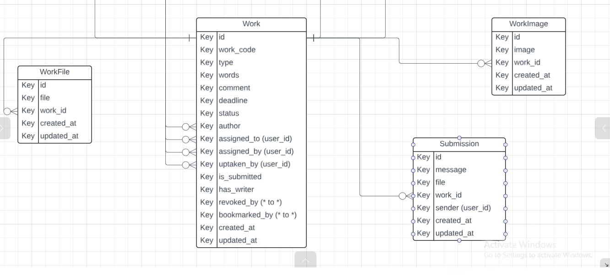
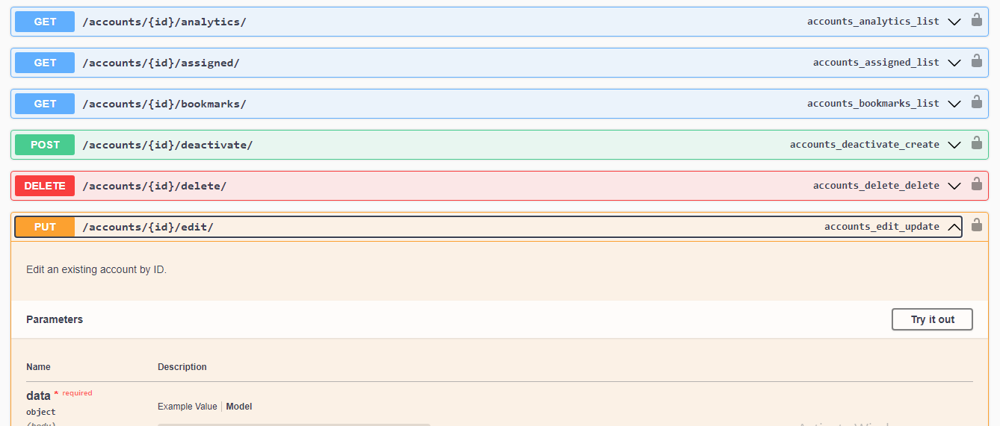

# Techwave Writers - Academic Writing Management Backend


## Description

Techwave Writers is a robust backend system for managing online writing assignments, work submissions, work allocations, work revisions and user notifications. Built with Django and Django REST Framework, it provides a seamless experience for both writers and admins.

## Features

- **User Management**: Register, update, and delete user accounts.
- **Work Management**: Create, edit, assign, and manage work submissions.
- **Notifications**: Get real-time updates on assigned work and system notifications.
- **Analytics**: View one's activity on the app and performance rating.
- **Profile Management**: Manage your profile by updating your details.
- **Work Consumption**: Take up work from the feed, complete, submit to admins, receive revisions.
- **Bookmarks**: Bookmark possible work that you could possibly uptake for easy access.
- **Searching and Filtering**: Search work by work code and filter work by available filters e.g type, deadline.

## ERD



Here is the Entity-Relationship Diagram (ERD) for the project.

Access it using this [link](https://lucid.app/lucidchart/711faf79-07e4-4c19-b594-2706abccafa2/edit?viewport_loc=-219%2C-6157%2C1767%2C671%2C0_0&invitationId=inv_844a1585-5e99-48ea-a0f4-62fb363f4a4a)

## Swagger Documentation

The API endpoints are documented using Swagger. You can view the full documentation [here](<[swagger_link](http://localhost:8000/swagger/)>).



## Installation

### Prerequisites

- Python 3.11.9 or higher

### Steps

1. Clone the repository:

   ```bash
   git clone https://github.com/SamuelMaiko/academic-backend.git
   ```

2. Navigate to the project directory:

   ```bash
   cd academic-backend
   ```

3. Create a virtual environment and activate it:

   - **In Linux**

   ```bash
   python -m venv env
   source env/bin/activate
   ```

   - **In Windows**

   ```bash
   python -m venv env
   env\Scripts\activate
   ```

4. Install dependencies:

   ```bash
   pip install -r requirements.txt
   ```

5. [Set up the environment variables](#environment-configuration)

6. Set up the database:

   - **For development purposes**, you can use SQLite. Ensure your `settings.py` file has the following configuration commented/uncommented accordingly:

     ```python
     # settings.py

     #Use this for development with SQLite

      DATABASES = {
          'default': {
              'ENGINE': 'django.db.backends.sqlite3',
              'NAME': BASE_DIR / 'db.sqlite3',
          }
      }


     ```

   - **For production purposes**, configure the environment variables in your `.env` file:

```bash
   #Use this for production with PostgreSQL

      DATABASES = {
         'default': {
             'ENGINE': 'django.db.backends.postgresql_psycopg2',
             'NAME': config('DATABASE_NAME'),
             'USER': config('DATABASE_USER'),
             'PASSWORD': config('DATABASE_PASSWORD'),
             'HOST': config('DATABASE_HOST'),
             'PORT': config('DATABASE_PORT', default='5432'),
         }
     }

```

```dotenv
DATABASE_NAME=your_database_name
DATABASE_USER=your_database_user
DATABASE_PASSWORD=your_database_password
DATABASE_HOST=your_database_host
DATABASE_PORT=your_database_port
```

7. Create a superuser for admin access:

   ```bash
   python manage.py createsuperuser
   ```

8. Start the development server:
   ```bash
   python manage.py runserver
   ```

## Environment Configuration

Before running the project, you need to set up your environment variables. Follow these steps:

1. Copy the example environment variables file to create your own `.env` file:

   ```bash
   cp .env.example .env
   ```

2. Open the `.env` file In **VS code**,

   **OR**

   ```bash
   nano .env
   ```

3. Fill in your own configuration details. Here’s an explanation of each variable:

   ```dotenv
   # .env

   DEBUG=True  # Set to False in production
   SECRET_KEY=your_secret_key

   # Postgres Database configuration for production
   DATABASE_NAME=your_database_name
   DATABASE_USER=your_database_user
   DATABASE_PASSWORD=your_database_password
   DATABASE_HOST=your_database_host
   DATABASE_PORT=your_database_port

   # Email settings
   EMAIL_BACKEND=your_email_backend
   EMAIL_HOST=your_email_host
   EMAIL_PORT=your_email_port  # Preferably use 465 for SSL
   EMAIL_USE_TLS=False  # Set to True if using TLS
   EMAIL_USE_SSL=True
   EMAIL_HOST_USER=your_email_user
   EMAIL_HOST_PASSWORD=your_email_password


   # Additional settings
   ALLOWED_HOSTS=localhost,127.0.0.1
   ```

## Usage

1. Access the development server at `http://127.0.0.1:8000/`.
2. Use API endpoints to interact with the portal (e.g., login, create work, uptake work, submit work).

## Planned Features

- **Real-Time Notifications**: Implement real-time updates using WebSockets to keep users informed about new assignments and notifications instantly.

- **In-App Chat System**: Develop a messaging system to facilitate communication between writers and admins directly within the application.

- **Teams Functionality**: Introduce team-based features allowing work to be assigned and managed collaboratively within groups.

- **Background Tasks**: Utilize Celery for handling asynchronous tasks, such as sending bulk notifications or processing long-running operations

## Known Issues

### 1. Database Configuration

- **Description:** The application is still using SQLite for the database and has not been connected to a hosted database.
- **Status:** Migration to a hosted database is planned
- **Workaround:** For development purposes, SQLite is sufficient. For production, please configure a PostgreSQL database as described in the [Installation](#installation) section.

### 2. Notifications

- **Description:** The application has not setup notifications in all necessary routes.

- **Status:** few endpoints have notifications e.g uptake work,revoke work ...

### 3. Serving Media

- **Description:** The application has not setup external file storage and handling.

- **Status:** Planning on integrating Cloudinary for serving media.

## Support and Assistance

If you have any questions about the codebase or encounter issues while working on it, feel free to reach out for assistance. Here are some ways to get support:

- **Contact:** You can reach out to [Maiko](mailto:samuel.maiko.dev@gmail.com) for assistance or clarification on any aspect of the code.
- **Documentation:** Refer to the project's documentation for guidance on setup, usage, and troubleshooting.
- **Issue Reporting:** If you encounter bugs or unexpected behavior, please report them by opening a new issue in the [GitHub Issues](https://github.com/SamuelMaiko/academic-backend/issues) section of this repository. Provide as much detail as possible, including steps to reproduce the issue, your environment, and any relevant logs or screenshots.

We're here to help ensure a smooth experience with the codebase and to address any questions or concerns you may have.

## License

This project is licensed under the MIT License - see the [LICENSE](LICENSE) file for details.

## Contact

Created by [Maiko](mailto:samuel.maiko.dev@gmail.com) - feel free to contact us!
